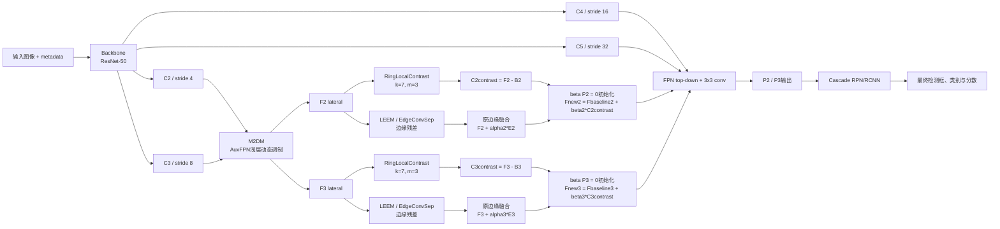

# VMCR-FPN B0 毕业论文材料

本文材料对应当前已经完成的 VMCR-FPN B0 实验。B、C 及其他扩展模块尚未实现或实验，文中不对其性能作推断。

## 一、方法改进

### 1.1 原始 AuxDet 结构与问题

原始 AuxDet 的信息流为：

```text
输入图像与 metadata → Backbone → M2DM → LEEM → FPN → Cascade RPN/RCNN → 预测结果
```

在现有实现中，AuxFPN 接收 ResNet-50 的多尺度特征，并在浅层 lateral feature 上执行由视觉特征和辅助 metadata 共同参与的动态调制。随后，原有的 `EdgeConvSep`（本文沿用 LEEM 的称呼）生成边缘残差，并通过残差加法增强浅层特征。最终实际送入检测头的是 P2 和 P3 两个输出层。

原结构的主要局限在于：LEEM 主要强调局部边缘变化，但红外小目标检测还依赖目标与其周围背景之间的局部对比关系。当背景具有缓慢变化、纹理干扰或局部亮度起伏时，仅使用边缘残差可能不足以显式刻画“目标区域相对于邻域背景的异常响应”。因此，本工作在不改变检测头和训练目标的前提下，在原有浅层特征增强路径旁增加一个局部背景对比分支。

### 1.2 环形局部背景建模

设某个浅层 lateral feature 为

\[
F\in\mathbb{R}^{B\times C\times H\times W}.
\]

VMCR-FPN B0 使用外窗口大小 \(k=7\)、内窗口大小 \(m=3\) 的环形邻域估计局部背景。外窗口平均池化包含中心区域和外围区域，内窗口平均池化近似表示中心区域。由两者的面积加权差可得到环形背景估计：

\[
B=\frac{k^2\operatorname{AvgPool}_{k}(F)-m^2\operatorname{AvgPool}_{m}(F)}{k^2-m^2}.
\]

其中，两个平均池化均采用 stride=1，并通过保持空间尺寸的 padding 使输出与输入具有相同的 \(H\times W\) 尺寸。B0 不使用局部标准差归一化，也不增加可学习卷积，因此该分支主要承担固定的局部背景估计功能。

在此基础上定义局部对比残差：

\[
C=F-B.
\]

当输入特征在局部区域内近似常量时，\(B\) 与 \(F\) 接近，\(C\) 接近零；当局部位置相对于环形邻域存在显著响应时，\(C\) 将保留该局部异常信息。这种形式与红外小目标“亮/暗目标相对于周围背景具有局部差异”的检测特性相匹配。

### 1.3 B0 的网络插入位置

B0 不替换原有 LEEM，也不改变 FPN 的 top-down 路径。对于浅层 lateral index 0 和 1（分别对应 P2 和 P3），先执行原 AuxDet 的边缘残差融合：

\[
F_{\text{baseline}}=F+\alpha_{l}\operatorname{EdgeConvSep}(F),
\]

其中 \(\alpha_l\) 是现有 AuxFPN 根据原有动态调制结果得到的边缘融合权重。之后再增加 VMCR 对比残差：

\[
F_{\text{new}}=F_{\text{baseline}}+\beta_l C.
\]

这里 \(l\in\{\mathrm{P2},\mathrm{P3}\}\)，每个层级拥有独立的可学习标量 \(\beta_l\)。B0 的初始化为：

\[
\beta_{\mathrm{P2}}=0,\qquad \beta_{\mathrm{P3}}=0.
\]

因此，模块刚接入时严格满足：

\[
F_{\text{new}}=F_{\text{baseline}}.
\]

这使得新模型初始输出与原 AuxDet 保持一致，避免随机初始化的对比分支在训练初期破坏已经学习到的检测表示。训练过程中，\(\beta_l\) 可以从零逐渐学习到适合数据的调制强度。

### 1.4 与原 EdgeConvSep 的关系

B0 保留原有 `EdgeConvSep` 及其参数和融合方式，不移动、不删除、不重命名该模块。这样做有三点原因：

1. 边缘残差和局部背景对比描述的是互补信息，前者强调边界变化，后者强调相对于邻域背景的差异。
2. 保留原路径可以使 B0 的性能变化更明确地归因于新增环形对比分支。
3. 原 checkpoint 中的 `edge_convs` 参数仍可直接复用，降低结构改动和权重加载风险。

B0 也不修改 Backbone、Cascade RPN、RCNN head、assigner、sampler、检测损失或训练框架，最终仍向检测头返回原来的 P2/P3。

### 1.5 P2/P3 beta 的实验解释

训练得到的最佳模型参数为：

| 层级 | beta |
|---|---:|
| P2 | 0.169534862 |
| P3 | 0.09604110 |

两个 beta 均从零学习到了非零值，说明在当前训练数据和目标函数下，模型保留了一定的局部对比残差信息。P2 的 beta 大于 P3，表明在本实验中更高空间分辨率的浅层特征对环形局部对比残差使用得更充分。不过，beta 是网络优化得到的融合系数，受特征尺度、参数化方式和训练状态影响，不能直接等同于某个域或某种物理因素的重要性，也不能据此宣称 P2 在物理意义上优于 P3。

## 二、网络结构图



图中 `RingLocalContrast` 只作用于 P2/P3 对应的浅层 lateral feature；原 LEEM 路径和 FPN top-down 路径均保留。

## 三、消融实验表

当前已完成的实验如下。AP50 和 Recall 使用小数形式记录。

| 方法 | AP50 | Recall | AP50 增量 | Recall 增量 |
|---|---:|---:|---:|---:|
| Baseline AuxDet | 0.779 | 0.872 | — | — |
| VMCR-FPN B0 | 0.787 | 0.872 | +0.008 | +0.000 |
| VMCR-FPN B | 未进行 | 未进行 | 未进行 | 未进行 |
| VMCR-FPN C | 未进行 | 未进行 | 未进行 | 未进行 |

相对增量计算为：

\[
\Delta AP50=0.787-0.779=0.008,
\]

\[
\Delta Recall=0.872-0.872=0.000.
\]

若以百分点表示，AP50 提升 0.8 个百分点，Recall 变化 0.0 个百分点。

## 四、实验结果分析

VMCR-FPN B0 的整体 AP50 从 Baseline AuxDet 的 0.779 提升到 0.787，增加 0.008；整体 Recall 均为 0.872，基本保持不变。这说明环形局部对比残差主要改善了检测结果的定位/分类质量或精度-召回曲线面积，而没有明显改变整体目标召回能力。换言之，B0 的收益更适合表述为“在不牺牲整体 Recall 的情况下提升 AP50”，而不应表述为显著提升了检出数量。

按域和波段统计的结果为：

| 域/波段 | AP50 | Recall |
|---|---:|---:|
| Air/LWIR | 0.979 | 0.982 |
| Land/LWIR | 0.866 | 0.900 |
| Space/LWIR | 0.384 | 0.673 |
| Space/NIR | 0.742 | 0.856 |
| Space/SWIR | 0.651 | 0.973 |

Space/NIR 达到 AP50=0.742、Recall=0.856，说明在该域/波段组合下，局部背景对比信息具有一定应用价值。对于 Space/LWIR 和 Space/SWIR，由于对应样本量较小，单个域/波段的 AP50 或 Recall 更容易受到样本构成、目标数量和预测分布影响，因此不能据此过度推断 VMCR 对该域具有稳定的普遍增益。特别是 Space/LWIR 的 AP50 相对较低，应将其视为后续误差分析对象，而不是仅凭一次结果归因于模块失效。

P2 beta=0.169534862、P3 beta=0.09604110 均为非零，说明优化过程确实使用了新增对比残差。但 beta 数值不能直接解释为“物理重要性”、域重要性或层级贡献比例，因为它与特征幅值、原有边缘权重、后续卷积和优化过程共同决定最终影响。更稳妥的结论是：模型学习到了非零的局部对比调制，并在整体 AP50 上呈现小幅正向变化。

## 五、创新点

1. **环形局部背景建模**：针对红外小目标与邻域背景之间的局部差异，在 AuxFPN 浅层引入由外窗口和内窗口构成的环形背景估计，并以无参数局部对比残差增强目标相关响应。
2. **与原边缘增强互补的轻量残差设计**：不替换原有 EdgeConvSep/LEEM，而是在原边缘残差融合完成后增加独立的局部对比分支，使边缘信息与背景对比信息保持清晰的功能分工。
3. **零初始化的安全接入机制**：为 P2 和 P3 设置独立的零初始化可学习 beta，使模块接入初始时严格等价于原 AuxDet，降低对已有检测能力和 checkpoint 兼容性的影响。
4. **局部化改动**：只修改 AuxFPN 的 P2/P3 浅层路径，不改变 Backbone、Cascade RPN/RCNN、损失函数和样本分配机制，便于进行可控消融。

## 六、局限性

1. B0 只改进 FPN 浅层特征，尚未验证对 Backbone 或检测头进行协同调整是否更有效。
2. 环形窗口固定为外核 7、内核 3，尚未研究不同窗口大小、可变窗口或多尺度环形组合。
3. 当前只完成 B0，B、C 及其他门控或扩展方案尚未进行，不能把未完成方案写成已验证结论。
4. 不同域/波段的提升并不完全一致，尤其 Space/LWIR 和 Space/SWIR 的样本量较小，结果稳定性和泛化性仍需更多实验支持。
5. beta 仅为每层一个标量，表达能力有限，不能针对不同样本或空间位置自适应调节对比残差强度。
6. 当前结果主要依据整体 AP50 和 Recall，尚未覆盖多随机种子、置信区间、不同 IoU 阈值和更细粒度误差类型分析。

## 七、毕业答辩简短说明

本研究在 AuxDet 的 AuxFPN 浅层 P2/P3 中加入了一个轻量的环形局部对比残差分支。该分支用 7×7 外窗口和 3×3 内窗口估计环形背景，再计算输入特征与环形背景之间的差异，并通过 P2、P3 两个零初始化的可学习 beta 加回原有特征。原 EdgeConvSep 边缘增强、Backbone、Cascade RPN/RCNN、损失和训练框架均保持不变。实验中整体 AP50 从 0.779 提升到 0.787，Recall 保持 0.872，说明局部背景对比信息在不降低整体召回的情况下带来了小幅检测质量提升。

## 八、可能被问到的问题与回答

### 问题 1：为什么使用环形背景，而不是直接使用一个大窗口平均池化？

回答：大窗口平均池化会把中心目标区域也作为背景的一部分。环形背景通过“大窗口总和减去小窗口总和”并进行面积归一化，近似排除中心区域，使背景估计更多来自目标周围区域，更符合局部对比检测的需求。

### 问题 2：为什么不删除原来的 EdgeConvSep？

回答：EdgeConvSep 主要提取边缘变化，环形对比分支主要描述目标与邻域背景的差异，两者信息互补。保留原分支还能使实验变量集中在新增的局部对比信息上，并降低旧 checkpoint 和原有检测能力受到破坏的风险。

### 问题 3：beta 为什么初始化为 0？

回答：beta 为 0 时，新增分支不改变原 AuxDet 的输出，因此模型可以从已经验证的 baseline 开始稳定学习。训练过程中 beta 再根据损失梯度学习是否使用以及使用多少局部对比残差。

### 问题 4：P2 beta 比 P3 beta 大，能否说明 P2 更重要？

回答：只能说明在当前参数化、特征尺度和训练数据下，优化得到的 P2 调制系数更大，不能直接解释为物理重要性或普遍结论。要比较层级重要性，还需要控制特征尺度并进行多次实验或专门的层级消融。

### 问题 5：Recall 没有提升，为什么 AP50 仍然提升？

回答：Recall 主要反映目标是否被检出，而 AP50 同时受排序、置信度和 IoU 匹配质量影响。B0 可能没有增加整体检出的目标数量，但改善了部分预测框的位置、置信度排序或误检控制，因此 AP50 可以提升而 Recall 基本不变。

